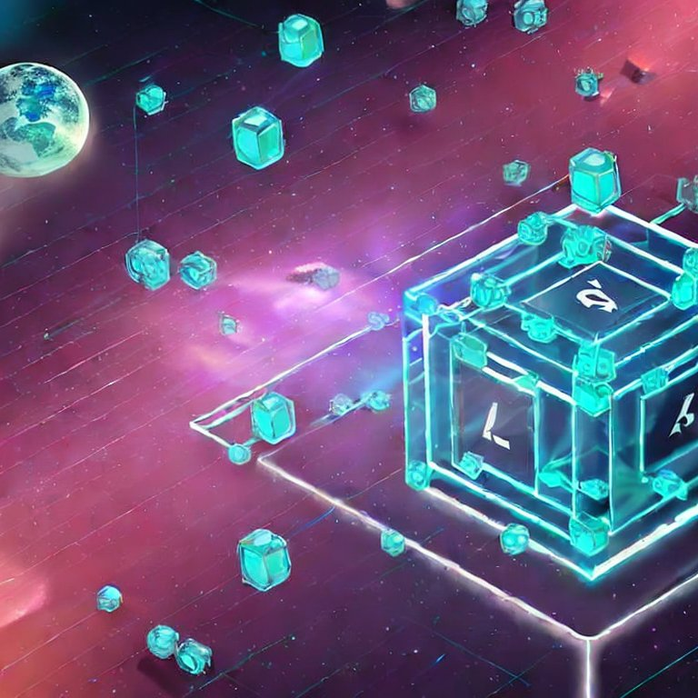

 ](https://img.shields.io/badge/python-3.9%20%7C%203.10-blue)
[](https://www.gnu.org/licenses/agpl-3.0)

# { level_up! : Web3 Security WarGames }

<p align="center">
  
</p>


**level_up!** es una plataforma de retos de smartcontracts en la que los usuarios pueden registrarse con su wallet y realizar distintos retos orientados a la seguridad de los mismos. En cada reto se puede encontrar el código Solidity correspondiente para su análisis.

**level_up!** se basa en la idea de que la mejor forma de mejorar la seguridad de los contratos inteligentes es a través de la participación activa. Al motivar a los usuarios a trabajar de una forma tan sencilla en la búsqueda de fallos de seguridad, esperamos mejorar las buenas prácticas de programación dentro de los contratos inteligentes.

## Requisitos
- Python 3.9 o 3.10
- [Ganache (CLI o GUI)](https://trufflesuite.com/ganache/)

## Ganache
La forma más sencilla de ejecutar Ganache es utilizar la versión GUI, ya que permite visualizar muy rápido la información necesaria y la instalación es fácil de realizar.

Es necesario conocer la información de configuración para luego indicarlo en el fichero que debe crearse con las [variables del entorno](#variables-del-entorno), como la dirección, el puerto, el chainId y una dirección junto a su clave privada.

## Variables del entorno

Para las variables del entorno debe existir un fichero llamado `.env` en la raíz del proyecto (igual que está el fichero `.flaskenv`) con la siguiente configuración:

```
# Files paths
FILE_BYTECODES_PATH=bytecode.json
FILE_ABI_PATH=abi.json
FILE_DATA_PATH=data.json
FILE_CONTRACT_ADDRESS=contract-address.json

# Blockchain settings
NETWORK=http://localhost:7545
NETWORK_NAME=ganache-gui
CHAIN_ID=1337
ADDRESS_OWNER=[ADDRESS_OWNER]
PRIVATE_KEY=[PRIVATE_KEY_HERE]

# Game settings
LEVEL_BASE=1000
LEVEL_NFT=1004
```

Se debe indicar la dirección y la clave privada para poder desplegar los contratos.

El fichero `.flaskenv` contiene las variables del entorno con la información sobre el lanzamiento de flask.

## Montaje sobre entorno virtual

**levelup!** puede instalarse sobre el entorno global de Python, sin embargo, si se quiere instalar sobre un entorno virtual se puede hacer uso de [`pipenv`](https://pipenv-es.readthedocs.io/es/latest/) o `venv`, entre otros.

A continuación se detalla la instalación haciendo uso de `pipenv` como gestor de los entornos virtuales.

En primer lugar, debe instalar `pipenv`. Posteriormente, sobre el directorio raiz del proyecto, se instalan las dependencias y se activa el entorno virtual:
```
pipenv install
pipenv shell
```

**Nota:** *Se debe asgurar que se utiliza una versión de Python compatible, como 3.9 o 3.10. Esto puede indicarse en el momento de la creación del entorno.*

## Ejecución

Finalmente, ejecutar **levelup!** con el comando `flask`:
```
flask run
```

## Docker

Para un despliegue más ágil, es posible ejecutar **levelup!** con Docker, montando todo el entorno al hacer uso del comando `docker-compose` en la raíz del proyecto:
```
docker-compose up
```
Si se hace uso de Docker, no es necesario la creación del fichero `.env`, ya que las variables del entorno se establecen en el archivo `Dockerfile`. En el `compose.yaml` se encuentran aquellas que tienen que ver con la configuración de la blockchain, como `NETWORK`, `NETWORK_NAME`, `ADDRESS_OWNER` y `PRIVATE_KEY`.

## Contacto

El objetivo de **level_up!** es el de facilitar el aprendizaje en un nuevo mundo disruptor. Recomendamos utilizarlo siempre en un entorno de pruebas, ya que está diseñado e implementado para funcionar en un entorno de pruebas. No recomendamos utilizarlo en una Blockchain de producción o real (dónde las transacciones cuesten dinero real y no nos hacemos responsables de dicho uso o de un mal uso de la plataforma).

Este software no tiene un proceso de control de calidad. Este software es una prueba de concepto. Si tiene algún problema, puede contactar en: ideaslocas@telefonica.com


